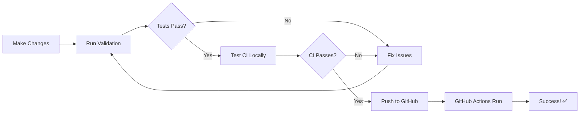

# Local CI/CD Testing Setup

Test your GitHub Actions workflows locally before pushing to ensure everything works! 🚀

## 📚 Documentation

- **[Quick Start Guide](QUICK_START_LOCAL_CI.md)** - Get started in 5 minutes
- **[Complete Documentation](LOCAL_CICD_TESTING.md)** - Full guide with all features
- **[Examples & Scenarios](EXAMPLES_LOCAL_CI.md)** - Real-world testing examples

## 🎯 Quick Commands

```bash
# Validate before pushing (recommended)
npm run validate

# Test CI pipeline locally
npm run ci:local

# Test specific job
npm run ci:local:test

# Dry run (see what would happen)
npm run ci:local:dry
```

## 📋 Files in This Setup

| File | Purpose |
|------|---------|
| `.actrc` | Act configuration (Docker images, settings) |
| `.secrets.example` | Template for local secrets |
| `.secrets` | Your actual secrets (gitignored) |
| `scripts/validate.ps1` | PowerShell validation script |
| `package.json` | NPM scripts for testing |

## 🚦 What Gets Tested

- ✅ **Linting** - Code quality checks
- ✅ **Tests** - Unit and integration tests
- ✅ **Build** - Production bundle creation
- ✅ **Dependencies** - Package installation
- ✅ **Coverage** - Test coverage reports

## 💡 Why Test Locally?

1. **Faster feedback** - Know if CI will pass before pushing
2. **Save time** - No waiting for GitHub Actions queue
3. **Save CI minutes** - Reduce GitHub Actions usage
4. **Better debugging** - Test changes iteratively
5. **Confidence** - Push knowing everything will pass

## 🔧 Setup Steps

1. **Install Act** (GitHub Actions runner)
   ```bash
   choco install act-cli
   ```

2. **Install Docker Desktop**
   - https://www.docker.com/products/docker-desktop/

3. **Create secrets file** (optional)
   ```bash
   cp .secrets.example .secrets
   # Edit .secrets with your keys
   ```

4. **Test it works**
   ```bash
   npm run ci:local:dry
   ```

## 📖 How It Works



## 🎓 Learn By Example

See `EXAMPLES_LOCAL_CI.md` for:
- Testing before push
- Testing pull requests
- Testing with secrets
- Debugging failures
- Speed optimization
- Real-world workflows

## 🆘 Need Help?

1. Check [Troubleshooting](LOCAL_CICD_TESTING.md#troubleshooting) section
2. Read [Act Documentation](https://github.com/nektos/act)
3. Review [Examples](EXAMPLES_LOCAL_CI.md)

## ⚡ Quick Reference

| Task | Command |
|------|---------|
| Full validation | `npm run validate` |
| Quick check | `npm run validate:quick` |
| Test all CI | `npm run ci:local` |
| Test one job | `npm run ci:local:test` |
| Dry run | `npm run ci:local:dry` |
| With secrets | `act --secret-file .secrets` |

---

**Ready to start?** Open [QUICK_START_LOCAL_CI.md](QUICK_START_LOCAL_CI.md) 🚀
